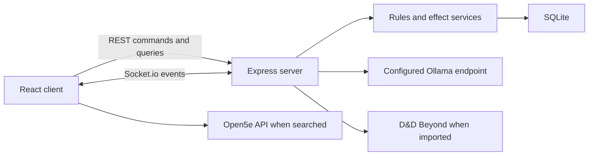

# Architecture

Arcane Ally is a React client and Node.js application server connected by REST and Socket.io, with SQLite as the authoritative campaign store.



## Entry Points

| Area | Entry point | Role |
|---|---|---|
| Client | `client/src/main.tsx` | React bootstrap |
| Player preview | `client/src/pages/PlayerPreview.tsx` | Isolated read-only player projection; does not load the normal application socket |
| Routes | `client/src/App.tsx` | Browser routes and application shell |
| Shared client state | `client/src/context/GameContext.tsx` | Socket lifecycle, normalized party state, DM token |
| Backend | `server/server.js` | Express routes, Socket.io handlers, broadcasts |
| Contract registry | `server/lib/automationContractRegistry.js` | Stable schemas, capabilities, validation, and version negotiation |
| Transaction orchestrator | `server/lib/processedCommands.js` | Idempotency, optimistic versions, audit records, and reconnect deltas |
| Transactional effects | `server/services/transactionalEffects.js` | All-or-nothing cross-character effect execution |
| Schema | `server/schema.js` | Startup migrations and seed defaults |
| Database | `server/db.js` | Better-SQLite3 connection and WAL mode |

## State Model

Arcane Ally separates permanent character data from table-session state.

- `characters` stores the base sheet: identity, class, level, maximum HP, equipment, attacks, features, and imported source data.
- `session_states` stores current HP, temporary HP, used resources, active conditions, buffs, concentration, and death saves.
- `initiative_tracker` stores encounter ordering and monster/PC combat state.
- `effect_events` stores the combat ledger and provenance records.
- `combat_sessions` groups live and archived encounter events.
- `campaign_state` stores server-wide settings such as automation policies and the current DM session token.
- `processed_commands` stores command fingerprints and results for deterministic retries.
- `aggregate_versions` stores optimistic versions for affected state aggregates.
- `campaign_clock` provides a total order across committed campaign mutations.
- `command_aggregates` records every aggregate and before/after version touched by a command.
- `command_audit_events` stores the general command-level provenance record.
- `state_deltas` stores the ordered reconnect stream.

Character resolution happens in `server/lib/rulesIntegration.js` and `server/lib/rulesEngine.js`, which combine the base sheet, session state, equipment, conditions, auras, and enabled automation policies.

## Real-Time Mutation Flow

1. A client emits a command envelope or sends a state-changing API request.
2. The REST or Socket.io boundary derives the command UUID, affected aggregates, actor, and expected versions.
3. The orchestrator checks for a prior receipt and validates the campaign and aggregate versions.
4. Rules calculate every target change before the final write. Multi-target effects reject the whole command if any target is invalid.
5. One SQLite `IMMEDIATE` transaction commits the mutations, command receipt, aggregate versions, campaign clock, audit event, and reconnect delta.
6. After commit, the server emits one canonical role-projected `state_delta`. Identical retries return the stored result without repeating the mutation or post-commit delivery.

Synchronous mutation handlers use compatibility middleware so existing REST routes and Socket.io events receive the same guarantees without changing their current payloads immediately. Work that calls D&D Beyond, Ollama, PDF parsing, report generation, or backup services completes that slow calculation first and places only its final database writes inside an explicit transaction boundary.

Legacy domain broadcasts remain during client migration, but `state_delta` is the stable automation and reconnect contract. A UUID proves retry identity, not caller authority.

Clients do not authoritatively merge campaign mutations. They normalize the server payload, retain the latest campaign and aggregate versions, and render the resulting state. On reconnect they request deltas after the last observed campaign version; a retention gap triggers a full role-safe snapshot.

## Automation Contract Registry

The v1 registry is mounted at `/api/v1/contracts`. It publishes JSON Schemas for command envelopes, active effects, provenance entries, calculated statistics, and state deltas, plus stable capability names for effects and automation hooks. Clients negotiate with `POST /api/v1/contracts/negotiate` or the `negotiate_automation_contract` socket event.

Stable v1 fields can only change compatibly. Experimental values live under `extensions` using `x-`-prefixed keys. See [Automation Contracts v1](./AUTOMATION_CONTRACTS.md) and [ADR-001](./architecture/ADR-001-transactional-command-orchestrator.md).

## Role-Safe Projection

`server/lib/clientStateProjection.js` creates DM, player, public, and cast-safe payloads. Hidden monsters remain DM-only, cast views receive broad monster health labels, and a registered player receives private details only for the owned character.

`server/lib/playerViewProjection.js` builds the DM's player-preview snapshot from authoritative state. The preview runs on the `/player-preview` Socket.io namespace, accepts only registration and refresh events, and never joins the normal campaign socket. A DM creates a short-lived link through `POST /api/player-preview/sessions`; the link is bound to the first browser tab that opens it.

This projection protects broadcast visibility. It does not make every REST mutation route authenticated; deployments still require the trusted-network controls described in [SECURITY.md](../SECURITY.md).

## Automation and Combat History

`server/lib/automationRules.js` normalizes campaign policies. Combat and effect services consult those policies for unconscious handling, concentration, bloodied state, modifier propagation, ammunition, turn triggers, auras, reactive handlers, initiative sync, and archive retention.

The timeline is append-oriented. Undo creates a correction event and marks the original record as reversed. Ending combat archives the current `combat_session`; retention pruning applies only to archived sessions.

## Authentication Boundaries

`POST /api/auth/dm` validates the configured PIN and stores one current DM token. Selected REST routes and DM Socket.io room membership validate that token. A successful login rotates it, invalidating the previous token.

The DM Dashboard first calls `GET /api/auth/dm/status` for a saved token. Protected controls render only after that check succeeds or after a new PIN login. Invalid sessions are cleared client-side and return to the access form.

Some older DM routes still accept a PIN header, and many campaign mutation routes assume a trusted network. Arcane Ally is not a multi-user identity or authorization platform.

## External Integrations

- Ollama receives AI prompts at `OLLAMA_URL` using the model selected by `OLLAMA_MODEL`.
- D&D Beyond is contacted for character imports and synchronization.
- Open5e is contacted directly by the client for SRD searches.
- WebRTC voice traffic is negotiated between browsers; secure contexts are required outside `localhost` in most browsers.

## Repository Layout

```text
client/                 React application
  src/components/       Reusable and domain UI
  src/context/          Shared real-time state
  src/pages/            Route-level views and Arcane Codex
server/                 Express and Socket.io backend
  lib/                  Rules, projections, auth, policy helpers
  contracts/v1/         Published JSON Schemas
  routes/               REST route modules
  services/             Effect, retention, and combat services
  test/                 Vitest coverage
docs/                   Living technical documentation
files/                  Historical parser/rules prototypes
```

Runtime databases, maps, uploads, backups, environment values, and character exports are intentionally absent from the repository. `server/db.js` creates the configured database path on first start, and `server/schema.js` upgrades both current and legacy schemas without bundling user state.
